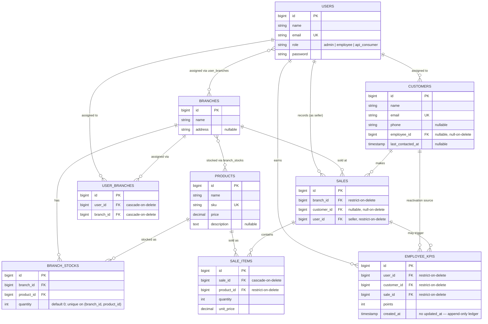

# SinodTech — Sales, Inventory & CRM System

A Laravel 13 API backend + React 19 SPA frontend for a multi-branch sales, inventory, and
customer-relationship system, orchestrated end-to-end with Docker Compose.

> **Setting this up or running it locally?** See the [Developer Guide](developer_guide.md) for
> Docker services, setup steps, environment configuration, database migrations/seeders, local run
> instructions, and seeded credentials. This README covers what's built and why.

## Completed features

### Core requirements

| Requirement | Status | Notes |
|---|---|---|
| Product catalog (name, SKU, price, stock) | ✅ | Full admin CRUD; SKU unique, price decimal(10,2) |
| Inventory control (deduct on sale, block insufficient stock) | ✅ | `StockService::adjust()` inside a DB transaction with `lockForUpdate()` — see [Architecture rationale](#architecture-rationale) |
| Customer purchase history (records, frequency, last purchase) | ✅ | `GET /admin/customers/{id}` returns full sale history, count, and last-purchase date |
| Lost-customer detection, configurable period | ✅ | `Customer::isLost()` / `Customer::scopeLost()`, threshold via `LOST_CUSTOMER_DAYS` (default 90) |
| Customer re-engagement (email/SMS) | ✅ (email) | Manual single + bulk endpoints, plus a daily scheduled sweep; queued Mailtrap notification |
| Employee assignment of inactive customers | ✅ | Admin-only `PATCH /admin/customers/{id}/assign`, restricted to `role = employee` users |
| KPI tracking on reactivation | ✅ | Event-driven, append-only ledger — see [Architecture rationale](#architecture-rationale) |

### Bonus features

| Bonus | Status | Notes |
|---|---|---|
| Multi-branch support | ✅ | Branch-scoped stock (`branch_stocks`), branch-scoped sales, and a full employee-branch assignment/session-switching flow (see below) |
| Email invoices | ✅ | Queued PDF invoice (DomPDF) sent via Mailtrap on every customer-linked sale |
| E-commerce API | ✅ | `GET /public/products` — SKU/name/price/available-stock, gated by a scoped Sanctum token (`products:read` ability), separate from the internal admin CRUD |

Beyond the assessment's own list, this build also adds **employee self-service** (a "My
Customers" view scoped to an employee's own assigned customers, with re-engage-only actions) and
**branch-aware sessions** (an employee working from a specific physical branch has that branch
applied automatically to sale creation and their product/sales views, rather than picking it
manually every time — full rationale below).

## Architecture rationale

**Branch-scoped stock table, not a column on `products`.** Stock is inherently per-location — a
`stock_quantity` column on `products` simply can't represent "10 units at Downtown, 0 at
Warehouse" at the same time. `branch_stocks` (`branch_id`, `product_id`, `quantity`, unique
composite on the pair) is the normalized shape for that from the start, not a bonus bolt-on added
after the fact.

**KPI as an append-only ledger, not a mutable counter.** `employee_kpis` gets one row per
KPI-earning event (`user_id`, `customer_id`, `sale_id`, `points`, and deliberately no
`updated_at` — rows are never modified after insert). An employee's total score is just
`SUM(points) GROUP BY user_id`. A mutable counter column would need a locked read-modify-write on
every reactivation purchase to stay correct under concurrent sales; an insert-only ledger sidesteps
that entirely — the same reasoning behind locking stock deduction, applied to a different table.

**Employee-branch context: a persistent pivot *plus* an ephemeral session value, not one column.**
`user_branches` (many-to-many) records which branches an employee is *allowed* to work from —
some employees cover more than one location. `session('active_branch_id')` records which one
they're *actively working from right now*. Collapsing this into a single `users.branch_id` column
would force a false choice: either an employee can only ever be assigned to one branch ever, or
there'd be no way to represent "assigned to two, currently working the first one." Splitting
long-lived assignment from short-lived working context is exactly what a pivot + session
combination is for. Sale creation, the product listing, and sales history all resolve the
employee's active branch server-side from this session value — an admin, by contrast, always
picks a branch manually, since an admin isn't "working from" any one branch.

**KPI tracking is event-driven, not called directly from `SaleService`.** `SaleService::process()`
fires a `SaleCreated` event (carrying a pre-computed `wasLost` flag) and knows nothing else about
CRM. A separate `IncrementEmployeeKpi` listener reacts to that event and decides for itself
whether the sale earns KPI points (the customer must have been lost *and* currently have an
assigned employee). Sales stays entirely ignorant of CRM's existence; CRM can change its own
reactivation rules without ever touching `SaleService`.

**Sanctum in both cookie and token mode.** One auth package covers two different kinds of caller:
the React SPA authenticates via a stateful, CSRF-protected session cookie (`auth:sanctum` +
`EnsureFrontendRequestsAreStateful`), while the third-party e-commerce integration authenticates
via a scoped, revocable personal access token (`ability:products:read`). Using Sanctum for both
avoids standing up and maintaining a second, bespoke API-key system just for the public endpoint.

**Two smaller decisions worth naming too:** stock deduction runs inside a DB transaction with
`lockForUpdate()` on the relevant `branch_stocks` row, so concurrent sale requests against the
same product/branch can't both read a stale quantity and oversell past zero (see
`ConcurrentSaleTest`/`StockServiceTest` for the test coverage of this). And invoice emails and
re-engagement notifications are both queued jobs, not sent synchronously inline during the
request — a slow or failing Mailtrap call never blocks a sale or a re-engagement API response.

### Laravel features & patterns in use

- **Events & Listeners** — `SaleCreated` (fired by `SaleService::process()`) →
  `IncrementEmployeeKpi` and `SendSaleInvoice` listeners. Decouples Sales from CRM/invoicing
  entirely — Sales fires one event and knows nothing about either consumer.
- **Task Scheduling** — `Schedule::command('customers:reengage')->daily()` in `bootstrap/app.php`,
  run by the dedicated `scheduler` container (`schedule:work`), not cron directly.
- **Queues** — the invoice email and re-engagement notification both implement `ShouldQueue`,
  processed by the dedicated `queue` container — never block a request on outbound mail.
- **Policies** — one Policy class per model (`ProductPolicy`, `SalePolicy`, `CustomerPolicy`,
  etc.), gated via route-level `can:` middleware rather than inline `if` checks in controllers.
- **Form Requests** — validation lives in dedicated Request classes (`StoreSaleRequest`,
  `AssignCustomerRequest`, etc.), not inline in controllers.
- **API Resources** — `ProductResource`, `SaleResource`, `CustomerResource`, etc. decouple the
  API's response shape from the database schema.
- **Eloquent relationships, including a custom pivot model** — `BranchStock` is a real model
  (`using(BranchStock::class)`), not a bare pivot table, since it carries its own business data
  (`quantity`) rather than just linking two IDs.
- **Sanctum, dual mode** — stateful SPA cookie auth and scoped bearer tokens from one auth
  package, rather than a second bespoke API-key system for the public endpoint.
- **Service layer** — `SaleService`/`StockService` keep controllers thin and isolate the
  transaction/locking logic that needs the most careful testing.
- **Config-driven business rules** — `config/crm.php` (`lost_customer_days`,
  `reactivation_points`, `recontact_cooldown_days`) instead of magic numbers scattered through the
  codebase.

## ERD

(Laravel framework tables — `cache`, `jobs`, `sessions`, `personal_access_tokens`, etc. — are
omitted; they're infrastructure, not domain model.)
